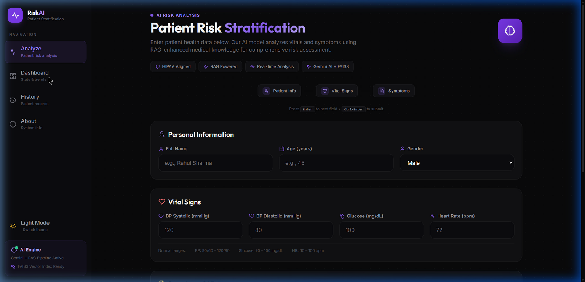
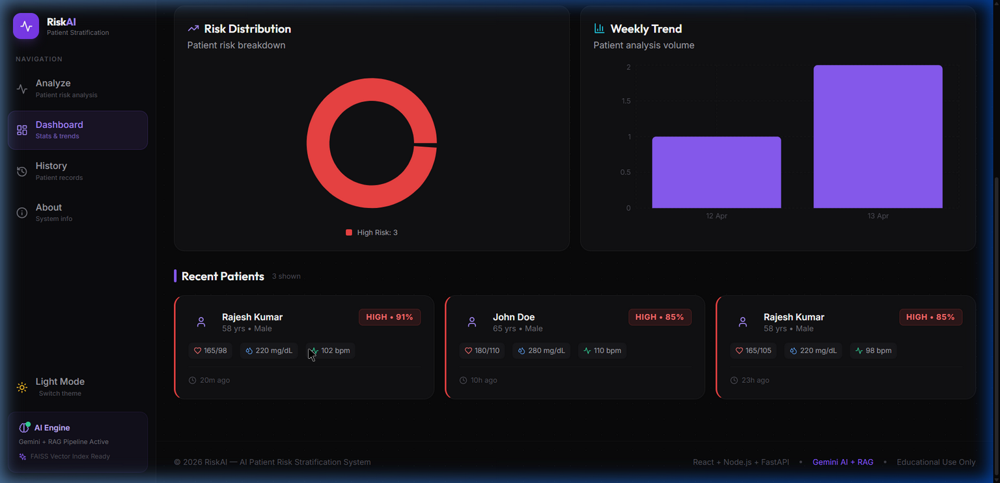
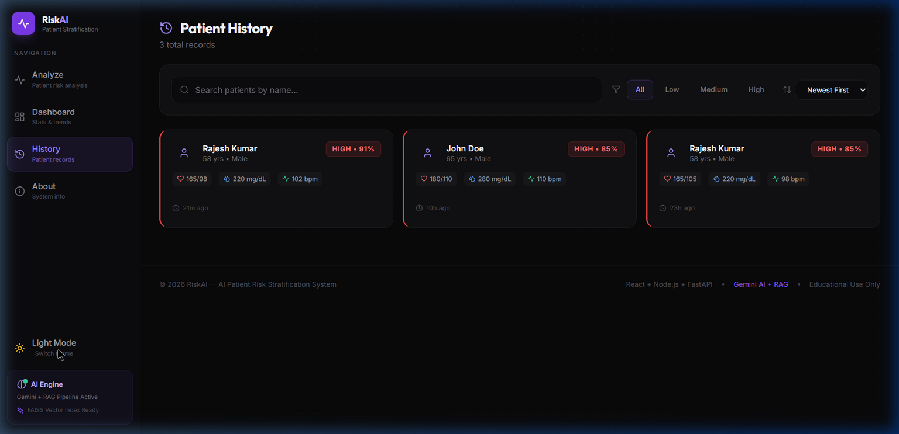
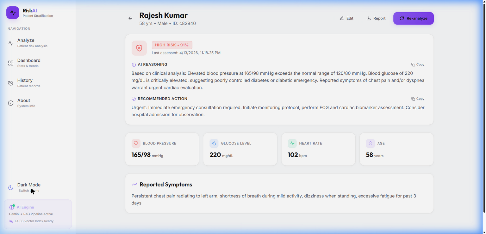
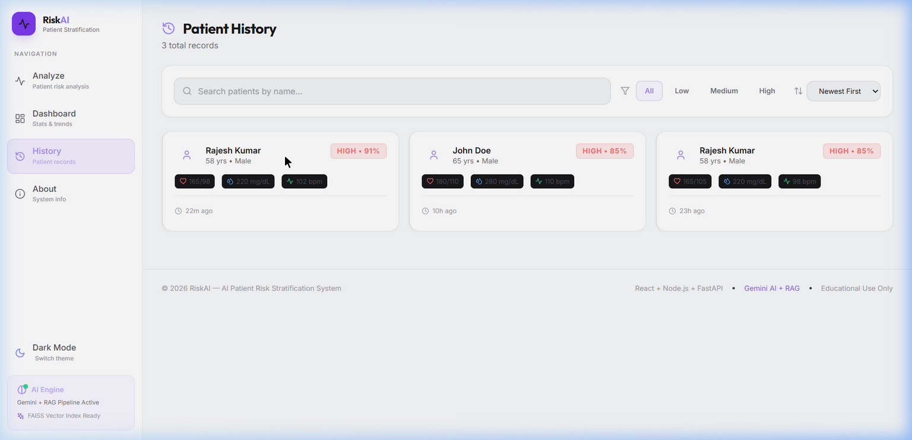

<p align="center">
  
  
  
  
  
  
</p>

<h1 align="center">🧠 RiskAI — AI Patient Risk Stratification System</h1>

<p align="center">
  <strong>Production-grade clinical decision support system powered by Google Gemini AI, RAG (Retrieval-Augmented Generation), and FAISS vector search.</strong>
</p>

<p align="center">
  Analyzes patient vitals, symptoms, and medical reports to generate real-time risk assessments<br/>
  with AI-driven reasoning and evidence-based clinical recommendations.
</p>

<p align="center">
  <a href="#-features">Features</a> •
  <a href="#%EF%B8%8F-architecture">Architecture</a> •
  <a href="#-tech-stack">Tech Stack</a> •
  <a href="#-quick-start">Quick Start</a> •
  <a href="#-deployment">Deployment</a> •
  <a href="#-api-reference">API Reference</a>
</p>

---

## 📸 Screenshots

### 🌑 Dark Mode

<table>
  <tr>
    <td width="50%">
      
      <p align="center"><strong>Home — Patient Analysis Form</strong></p>
    </td>
    <td width="50%">
      
      <p align="center"><strong>Dashboard — Charts & Stats</strong></p>
    </td>
  </tr>
  <tr>
    <td width="50%">
      
      <p align="center"><strong>Patient History — Search & Filter</strong></p>
    </td>
    <td width="50%">
      
      <p align="center"><strong>Patient Detail — AI Risk Assessment</strong></p>
    </td>
  </tr>
</table>

### ☀️ Light Mode

<table>
  <tr>
    <td width="50%">
      
      <p align="center"><strong>Patient History — Light Mode</strong></p>
    </td>
    <td width="50%">
      
      <p align="center"><strong>Patient Detail — Light Mode</strong></p>
    </td>
  </tr>
</table>

---

## ✨ Features

### 🔬 AI-Powered Risk Analysis
- **Gemini 2.0 Flash** with automatic fallback chain (`gemini-2.0-flash` → `gemini-1.5-flash` → `gemini-1.5-pro`)
- **RAG Pipeline** — FAISS vector index with 47 medical knowledge chunks for context-aware analysis
- **Structured JSON output** — Risk level, probability score, clinical reasoning, and recommended actions
- **Rule-based fallback** — Works even when AI service is unavailable

### 📊 Clinical Dashboard
- Real-time risk distribution (pie chart) and weekly trend analysis (bar chart)
- Live health monitoring dots for Backend & AI Service status
- Recent patients grid with color-coded risk badges
- Responsive charts with touch-scrollable mobile support

### 🏥 Patient Management
- **Create** — Submit patient data with vitals, symptoms, and optional PDF report upload
- **Read** — Detailed patient view with full assessment history and vitals grid
- **Update** — Inline edit mode for patient data with save/cancel workflow
- **Delete** — Confirmation modal with soft UI (no browser alerts)
- **Re-analyze** — Re-run AI analysis on existing patients to track risk over time
- **Search & Filter** — By name, risk level, sort order, with debounced search and pagination

### 🎨 Premium UI/UX
- **Dark/Light Mode** — Toggle with localStorage persistence
- **Keyboard Navigation** — `Enter` → next field, `Ctrl+Enter` → submit
- **Copy-to-Clipboard** — One-click copy on AI reasoning and recommendations
- **PDF Report Export** — Print-optimized layout with clean medical report styling
- **Loading Progress** — 5-step animated progress indicator during AI analysis
- **Mobile Bottom Nav** — Tab bar navigation on mobile devices
- **Framer Motion** — Page transitions, card animations, probability circle animations

### 🔐 Security
- **JWT Authentication** — Token-based auth with demo mode toggle (`AUTH_ENABLED=false`)
- **Rate Limiting** — 100 requests/15min per IP on analysis endpoint
- **PDF Magic Byte Validation** — Validates `%PDF-` file header, not just MIME type
- **Regex Sanitization** — Prevents ReDoS attacks on search queries
- **Input Validation** — Express-validator middleware on all endpoints
- **Graceful Shutdown** — SIGTERM/SIGINT handlers with MongoDB connection cleanup

---

## 🏗️ Architecture

```
┌─────────────┐     ┌──────────────────┐     ┌─────────────────────┐
│   React     │────▶│  Node.js/Express │────▶│  FastAPI (Python)    │
│  Frontend   │     │   API Gateway    │     │   AI Microservice    │
│  Port 3000  │     │   Port 5000      │     │   Port 8000          │
└─────────────┘     └───────┬──────────┘     └──────────┬──────────┘
                            │                           │
                            ▼                           ▼
                     ┌──────────────┐          ┌────────────────┐
                     │   MongoDB    │          │  Google Gemini  │
                     │  (Database)  │          │  + FAISS (RAG)  │
                     └──────────────┘          └────────────────┘
```

| Layer | Technology | Purpose |
|-------|-----------|---------|
| **Frontend** | React 18, Vite, Tailwind CSS, Framer Motion | Patient forms, dashboard, charts |
| **API Gateway** | Node.js, Express, Mongoose | REST API, validation, auth, MongoDB |
| **AI Service** | FastAPI, Google Gemini, FAISS, SentenceTransformer | Risk analysis, RAG retrieval |
| **Database** | MongoDB (Atlas for production) | Patient records, assessment history |
| **Vector Store** | FAISS (CPU) + all-MiniLM-L6-v2 | Medical knowledge embeddings |

---

## 🛠 Tech Stack

### Frontend
| Technology | Version | Purpose |
|-----------|---------|---------|
| React | 18.2 | UI framework |
| Vite | 5.1 | Build tool & dev server |
| Tailwind CSS | 3.4 | Utility-first styling |
| Framer Motion | 11.0 | Animations & transitions |
| Recharts | 2.12 | Dashboard charts |
| React Router | 6.22 | Client-side routing |
| Lucide React | 0.323 | Icon system |
| Axios | 1.6 | HTTP client |

### Backend
| Technology | Version | Purpose |
|-----------|---------|---------|
| Node.js | 18+ | Runtime |
| Express | 4.18 | Web framework |
| Mongoose | 8.1 | MongoDB ODM |
| jsonwebtoken | 9.0 | JWT authentication |
| Multer | 1.4 | File upload handling |
| pdf-parse | 1.1 | PDF text extraction |
| express-validator | 7.0 | Input validation |

### AI Service
| Technology | Version | Purpose |
|-----------|---------|---------|
| Python | 3.11 | Runtime |
| FastAPI | 0.109 | Async web framework |
| google-generativeai | 0.8+ | Gemini AI SDK |
| FAISS | 1.7+ | Vector similarity search |
| SentenceTransformers | 2.3 | Text embeddings |
| Pydantic | 2.5 | Data validation |

---

## 🚀 Quick Start

### Prerequisites
- **Node.js** 18+ & npm
- **Python** 3.11+
- **MongoDB** (local or [MongoDB Atlas](https://cloud.mongodb.com) free tier)
- **Gemini API Key** (free at [aistudio.google.com/apikey](https://aistudio.google.com/apikey))

### 1. Clone & Install

```bash
git clone https://github.com/tapendra9104/AI-Based-Patient-Risk-Stratification-system.git
cd AI-Based-Patient-Risk-Stratification-system

# Backend dependencies
cd backend && npm install && cd ..

# AI service dependencies
cd ai-service && pip install -r requirements.txt && cd ..

# Frontend dependencies
cd frontend && npm install && cd ..
```

### 2. Configure Environment

```bash
# Backend
cp backend/.env.example backend/.env
# Edit backend/.env → set MONGODB_URI

# AI Service
cp ai-service/.env.example ai-service/.env
# Edit ai-service/.env → set GEMINI_API_KEY
```

### 3. Start All Services

Open **3 terminals**:

```bash
# Terminal 1 — Backend (API Gateway)
cd backend && npm start

# Terminal 2 — AI Service (Python)
cd ai-service && uvicorn main:app --host 0.0.0.0 --port 8000

# Terminal 3 — Frontend (React)
cd frontend && npm run dev
```

### 4. Open the App

Navigate to **http://localhost:3000** 🎉

---

## ☁️ Deployment

### Deploy to Render (Recommended)

This project includes a `render.yaml` blueprint for **one-click deployment**:

1. **Push to GitHub** (this repo)
2. **Create a free [MongoDB Atlas](https://cloud.mongodb.com) cluster** → get connection string
3. **Go to [Render Dashboard](https://dashboard.render.com/blueprints)** → New Blueprint Instance
4. **Connect your GitHub repo** → Render auto-detects `render.yaml`
5. **Set environment variables:**
   - `MONGODB_URI` → Your MongoDB Atlas connection string
   - `GEMINI_API_KEY` → Your Gemini API key
6. **Deploy** — Render creates all 3 services automatically

| Service | Type | Root Dir | Build Command | Start Command |
|---------|------|----------|---------------|---------------|
| `riskai-backend` | Web Service (Node) | `/backend` | `npm install` | `node server.js` |
| `riskai-ai-service` | Web Service (Python) | `/ai-service` | `pip install -r requirements.txt` | `uvicorn main:app --host 0.0.0.0 --port $PORT` |
| `riskai-frontend` | Static Site | `/frontend` | `npm install && npm run build` | Serves `dist/` |

---

## 📡 API Reference

### Patient Endpoints

| Method | Endpoint | Description | Auth |
|--------|----------|-------------|------|
| `POST` | `/api/patient/analyze` | Submit patient for AI analysis | 🔒 |
| `GET` | `/api/patient/history` | List all patients (filter, search, sort, paginate) | — |
| `GET` | `/api/patient/stats` | Dashboard statistics | — |
| `GET` | `/api/patient/:id` | Get patient by ID | — |
| `PUT` | `/api/patient/:id` | Update patient data | 🔒 |
| `DELETE` | `/api/patient/:id` | Delete patient record | 🔒 |
| `POST` | `/api/patient/:id/reanalyze` | Re-run AI analysis | — |

### Upload & Health

| Method | Endpoint | Description |
|--------|----------|-------------|
| `POST` | `/api/upload` | Upload PDF report (text extraction) |
| `GET` | `/api/health` | Backend health check |
| `GET` | `/api/health/ai` | AI service health proxy |
| `POST` | `/api/auth/demo-token` | Generate demo JWT token |

### Example: Analyze Patient

```bash
curl -X POST http://localhost:5000/api/patient/analyze \
  -H "Content-Type: application/json" \
  -d '{
    "name": "Rajesh Kumar",
    "age": 58,
    "gender": "Male",
    "bloodPressure": { "systolic": 165, "diastolic": 98 },
    "glucoseLevel": 220,
    "heartRate": 102,
    "symptoms": "Chest pain radiating to left arm, shortness of breath"
  }'
```

### Example Response

```json
{
  "success": true,
  "data": {
    "patient": { "_id": "...", "name": "Rajesh Kumar", "..." },
    "riskAssessment": {
      "risk": "High",
      "probability": "91%",
      "reason": "Elevated blood pressure at 165/98 mmHg...",
      "action": "Urgent: Immediate emergency consultation required..."
    }
  }
}
```

---

## 📁 Project Structure

```
AI-Based-Patient-Risk-Stratification/
├── frontend/                    # React (Vite) Frontend
│   ├── src/
│   │   ├── components/          # Reusable UI components
│   │   │   ├── PatientForm.jsx  # Patient input form + validation
│   │   │   ├── RiskResult.jsx   # AI assessment display
│   │   │   ├── Sidebar.jsx      # Navigation sidebar
│   │   │   ├── PatientCard.jsx  # Patient list card
│   │   │   ├── ConfirmModal.jsx # Delete confirmation
│   │   │   └── ErrorBoundary.jsx# Crash protection
│   │   ├── pages/               # Route pages
│   │   │   ├── Home.jsx         # Patient analysis
│   │   │   ├── Dashboard.jsx    # Stats & charts
│   │   │   ├── History.jsx      # Patient records
│   │   │   ├── PatientDetail.jsx# Full patient view
│   │   │   └── About.jsx       # System info
│   │   ├── services/api.js      # Axios HTTP client
│   │   ├── App.jsx              # Router + Theme context
│   │   └── index.css            # Design system
│   └── package.json
│
├── backend/                     # Node.js (Express) API Gateway
│   ├── routes/
│   │   ├── patientRoutes.js     # CRUD + AI analysis endpoints
│   │   └── uploadRoutes.js      # PDF upload + validation
│   ├── models/Patient.js        # MongoDB schema
│   ├── middleware/
│   │   ├── authMiddleware.js    # JWT authentication
│   │   ├── validation.js        # Input validation
│   │   └── errorHandler.js      # Global error handling
│   ├── config/db.js             # MongoDB connection
│   ├── server.js                # Express entry point
│   └── package.json
│
├── ai-service/                  # Python (FastAPI) AI Microservice
│   ├── services/
│   │   ├── llm_service.py       # Gemini AI integration
│   │   └── rag_service.py       # FAISS + SentenceTransformer
│   ├── models/schemas.py        # Pydantic data models
│   ├── knowledge_base/          # RAG medical documents (5 files)
│   ├── main.py                  # FastAPI entry point
│   └── requirements.txt
│
├── render.yaml                  # Render deployment blueprint
├── .gitignore
└── README.md
```

---

## 🔧 Environment Variables

### Backend (`backend/.env`)
| Variable | Required | Description |
|----------|----------|-------------|
| `MONGODB_URI` | ✅ | MongoDB connection string |
| `PORT` | — | Server port (default: 5000) |
| `AI_SERVICE_URL` | — | AI service URL (default: http://localhost:8000) |
| `JWT_SECRET` | — | JWT signing secret (auto-generated on Render) |
| `AUTH_ENABLED` | — | Enable JWT auth (default: false) |
| `FRONTEND_URL` | — | Frontend URL for CORS (production) |

### AI Service (`ai-service/.env`)
| Variable | Required | Description |
|----------|----------|-------------|
| `GEMINI_API_KEY` | ✅ | Google Gemini API key |
| `LLM_PROVIDER` | — | AI provider: `gemini` or `openai` (default: gemini) |
| `EMBEDDING_MODEL` | — | SentenceTransformer model (default: all-MiniLM-L6-v2) |

### Frontend (build-time)
| Variable | Required | Description |
|----------|----------|-------------|
| `VITE_API_URL` | — | Backend URL for production (empty = Vite proxy for dev) |

---

## 📜 License

This project is for **educational and demonstration purposes**. Not intended for actual clinical use without proper medical validation, regulatory compliance, and security hardening.

---

<p align="center">
  Built with ❤️ using React, Node.js, FastAPI, and Google Gemini AI
</p>
